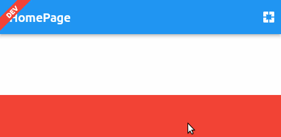

<!--
This README describes the package. If you publish this package to pub.dev,
this README's contents appear on the landing page for your package.

For information about how to write a good package README, see the guide for
[writing package pages](https://dart.dev/guides/libraries/writing-package-pages).

For general information about developing packages, see the Dart guide for
[creating packages](https://dart.dev/guides/libraries/create-library-packages)
and the Flutter guide for
[developing packages and plugins](https://flutter.dev/developing-packages).
-->

# Very simple another App Badge Library 

## Features

- Just add badge to your app's left top corner 
- You decide what to do with it
- Depends on basic flutter widgets. No material or Cupertino dependency.
- That is it, Very simple

## Getting started

### Add dependency to pubspec.yaml
```yaml
  app_badge:
    git: git@github.com:hurelhuyag/app_badge.git
```

### Fetch dependencies
```
flutter pub get
```

## Usage

to `/example` folder.

```dart
const String env = String.fromEnvironment("env", defaultValue: "dev");

void main() {
  runApp(const MyApp());
}

class MyApp extends StatelessWidget {
  const MyApp({super.key});

  @override
  Widget build(BuildContext context) {
    return AppBadge(
      textColor: Colors.white,
      backgroundColor: Colors.red,
      text: env.toUpperCase(),
      visible: env != "prod",
      child: MaterialApp(
        title: 'App Badge Demo',
        theme: ThemeData(
          primarySwatch: Colors.blue,
        ),
        home: const HomePage(),
      ),
    );
  }
}
```

When you change `--dart-define="env=dev"` parameter when building, your badge will change accordingly.
Obviously, when the environment is the production /prod/, AppBadge will disappear.

## Result



## Additional information

If you have idea in your mind, Feel free to open an issue or pull request.
